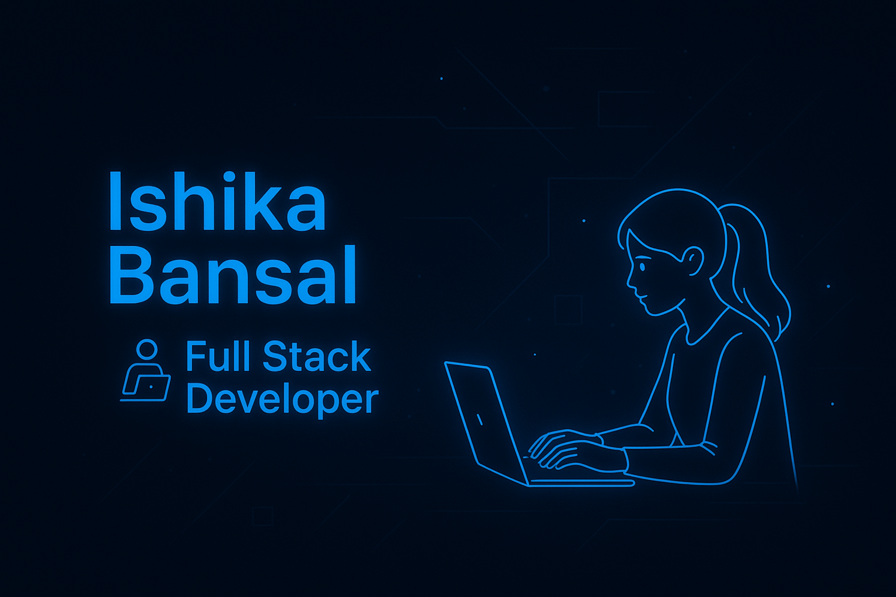

<!-- 🌟 GitHub Banner -->

  

<!-- 🌸 Ishika Bansal | Modern, Creative GitHub Profile -->

<h1 align="center">
   
  Hey there, I'm Ishika Bansal ✨
</h1>

<h3 align="center">💻 Full-Stack Developer | Creative UI/UX Enthusiast | Tech Dreamer 🚀</h3>

<!-- ✨ Typing Animation -->

  

<!-- 💫 Glowing Divider -->

  <svg width="75%" height="5">
    <defs>
      <linearGradient id="glow-divider">
        <stop offset="0%" stop-color="#00b4d8">
          <animate attributeName="stop-color" values="#00b4d8;#38bdf8;#00b4d8" dur="4s" repeatCount="indefinite" />
        </stop>
        <stop offset="100%" stop-color="#38bdf8">
          <animate attributeName="stop-color" values="#38bdf8;#00b4d8;#38bdf8" dur="4s" repeatCount="indefinite" />
        </stop>
      </linearGradient>
    </defs>
    <rect width="100%" height="5" fill="url(#glow-divider)" rx="5" ry="5">
      <animate attributeName="opacity" values="0.6;1;0.6" dur="3s" repeatCount="indefinite" />
    </rect>
  </svg>

---

### 👩‍💻 About Me  

<table>
  <tr>
    <td width="60%" valign="top">

🌸 Hey! I’m **Ishika Bansal**, a passionate **Full-Stack Developer** and **UI/UX enthusiast** who loves building web applications that are not only functional but also visually delightful.  

💫 I’m currently pursuing my **B.Tech in Computer Science and Engineering** from [Maharishi Markandeshwar (Deemed to be University)](https://www.mmumullana.org/), where I’ve grown into a developer who believes in the perfect blend of **logic, design, and user empathy.**  

💻 My expertise lies in crafting **interactive, responsive, and user-first experiences** using the **MERN stack**, with a strong focus on modern aesthetics and seamless usability.  

🎨 I adore **UI/UX**, love experimenting with new design systems, and enjoy transforming abstract ideas into engaging, real-world applications.  

🌱 Currently exploring **React Animations, Framer Motion, and Next.js**, while continuously improving my design eye and backend efficiency.  

💬 I believe — *great developers don’t just write code; they create experiences that feel alive.*  

  </td>
  <td width="40%" align="center">

<!-- 💻 Glowing Coding GIF -->
  
  </td>
  </tr>
</table>

---

### 🛠️ Tech Arsenal  

#### 💻 Frontend Magic  

  

#### ⚙️ Backend & Databases  

  

#### 🧩 Tools I Love  

  

---

### 🚀 Featured Projects  

| 🌟 Project | 🧠 Description | 🧰 Tech Stack |
|-------------|----------------|---------------|
| 🧭 **PlanPilot** | Agile project management web app with payment integration and sprint tracking for smoother workflows. | ReactJS, Firebase, Tailwind CSS, ShadCN UI |
| 💬 **CureCrafter** | AI-based health platform featuring a chatbot for home remedies and symptom analysis. | ReactJS, Tailwind CSS, AI/ML |
| 💼 **JobGenie** | Job portal with secure authentication, role-based access, and a sleek UI. | ReactJS, Node.js, Supabase, Clerk |
| 📊 **Interactive Dashboard** | Real-time analytics dashboard with drag-and-drop charts and Kanban view. | ReactJS, Tailwind CSS, Recharts |
| 🛰️ **Terrain Generator** | AI model that transforms satellite images into geospatial maps for better visualization. | TensorFlow, OpenCV |

> 🌟 Explore all my creations in the [Repositories Section →](https://github.com/Ishika-45?tab=repositories)

---

### 🏆 Achievements  

- 🥈 **1st Runner-Up** at **Alpha Hack 2024**  
- 💡 Participated in **5+ National Hackathons** delivering innovative, real-world solutions  
- 🤖 **Core Team Member**, *Robotronics Club* – Led 4 technical workshops  
- 🎯 **Student Organizer**, *UniversuMM23* – Managed Robosoccer & RoboBlitzz events  

---

### 📊 GitHub Analytics  

  

  
  

> 📌 *Live GitHub stats may vary due to API limits.*

---

### ✨ Design & Development Philosophy  

> “I don’t just build websites — I craft experiences.  
> Every color, transition, and click should make the user *feel* something.  
> My mission is to make technology elegant, meaningful, and human.”  

---

### 🌐 Connect With Me  

  
  
  
  

---

### 🪄 Fun Animation  

  

---

  

---

<!-- ✨ Futuristic Footer with Pulse Glow -->

  <svg width="100%" height="5">
    <defs>
      <linearGradient id="glow-footer">
        <stop offset="0%" stop-color="#00b4d8">
          <animate attributeName="stop-color" values="#00b4d8;#38bdf8;#00b4d8" dur="4s" repeatCount="indefinite" />
        </stop>
        <stop offset="100%" stop-color="#38bdf8">
          <animate attributeName="stop-color" values="#38bdf8;#00b4d8;#38bdf8" dur="4s" repeatCount="indefinite" />
        </stop>
      </linearGradient>
    </defs>
    <rect width="100%" height="5" fill="url(#glow-footer)" rx="5" ry="5">
      <animate attributeName="opacity" values="0.6;1;0.6" dur="3s" repeatCount="indefinite" />
    </rect>
  </svg>

   
  <b style="color:#38bdf8;">✨ Crafted with Passion & Code by Ishika Bansal ✨</b> 
  <i>"Design. Develop. Deliver."</i>

  
