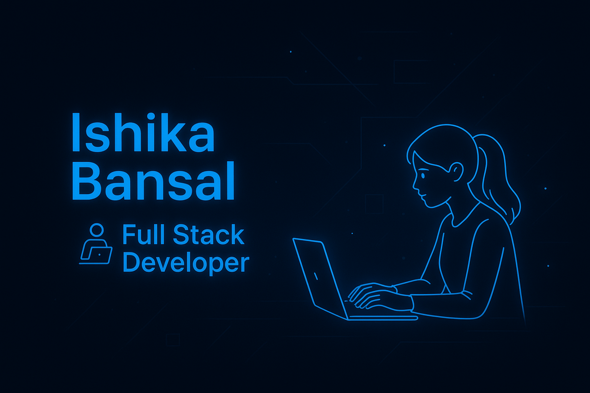

<!-- ===================== BANNER ===================== -->

  

<h1 align="center">
  Hi 👋, I'm Ishika Bansal
</h1>

<h3 align="center">
🚀 Full Stack Product Engineer | AI-Powered SaaS Builder | React • Node.js • PostgreSQL
</h3>

  

---

# 👩‍💻 About Me

I'm a Computer Science Engineering student passionate about building scalable software products and modern web applications.

My focus lies in combining:

* ⚡ Product Engineering
* 🤖 AI-Powered Applications
* 🌐 Full Stack Development
* 🚀 SaaS Platforms
* 🎨 Modern User Experiences

Currently building production-grade applications using React, Node.js, PostgreSQL, and modern cloud technologies.

---

# 🛠 Tech Stack

### Frontend

### Backend

### Databases

### Tools & DevOps

---

# 🚀 Featured Projects

## 🌟 EvolveWeb AI

### AI-Powered SaaS Website Builder

* Generate startup website structures using AI
* OpenAI-powered content generation workflows
* Secure JWT Authentication & OAuth
* Project dashboards and workspace management
* Modern SaaS architecture

**Tech Stack**

React.js • Node.js • Express.js • MongoDB • OpenAI API

🔗 Repository:
https://github.com/Ishika-45/EvolveWebAI

---

## 💼 JobGenie

### AI-Assisted Recruitment Platform

* Job posting and application workflows
* Secure authentication with Clerk
* Database management using Supabase
* Responsive modern UI
* Scalable recruitment system

**Tech Stack**

React.js • Node.js • Supabase • Clerk

🔗 Repository:
https://github.com/Ishika-45/JobGenie

---

## 📋 PlanPilot

### Agile Project Management Platform

* Kanban boards
* Sprint management
* Task tracking workflows
* Real-time updates
* Productivity dashboard

**Tech Stack**

React.js • Firebase • Tailwind CSS • ShadCN UI

🔗 Repository:
https://github.com/Ishika-45/PlanPilot

---

# 🏆 Highlights

🥈 1st Runner-Up — Alpha Hack 2024

💼 Selected for Software Engineer Roles at:

* Infosys
* Capgemini

🎓 B.Tech Computer Science Engineering

* CGPA: 8.72

🏅 ServiceNow Certified System Administrator

💻 Solved 250+ DSA Problems

🤖 Participated in Multiple National-Level Hackathons

---

# 🌱 Current Focus

* Building AI-Powered SaaS Applications
* Learning Next.js
* Learning TypeScript
* Exploring Prisma ORM
* Improving System Design Fundamentals
* Open to Software Engineering Opportunities

---

# 📊 GitHub Analytics

---

# 🤝 Let's Build Something Amazing

I'm passionate about building:

✔ AI-Powered Products

✔ SaaS Platforms

✔ Full Stack Applications

✔ Startup Solutions

✔ Modern User Experiences

I'm currently open to:

* Software Engineering Roles
* Internships
* Freelance Projects
* Startup Collaborations

---

# 🌐 Connect With Me

---

---

<b>🚀 Building Products. Solving Problems. Creating Impact.</b>

